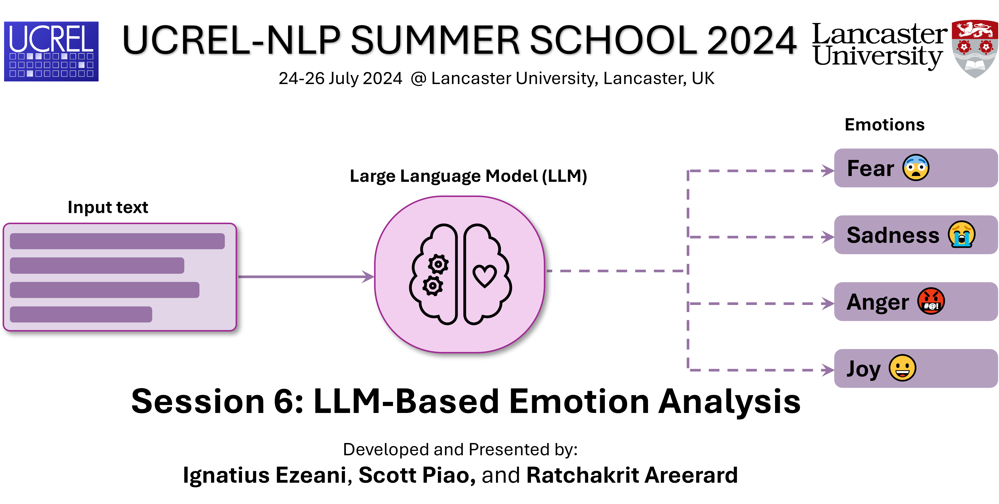

# Session-6-LLM-Based-Emotion-Analysis

## **Introduction**
With the advent the transformer based of large language models (LLMs) such as BERT, LLAMA, Gemini etc., the NLP community has tapped into these models for developing new techniques and methodologies for a wide range of NLP tasks. One key NLP task that can benefit from such resources is the Emotion Analysis, which is a highly challenging NLP task.  

In this tutorial, we will learn how to:
1. **Apply LLMs to emotion classification tasks**
2. **Evaluate the performance of different models**
3. **Fine-tune a model to perform better on specific classification tasks**

## **Tasks**
To achieve the objectives above, we will need perform the following tasks:

- **Section 1: Preamble** - download tutorial materials and set path to working folder.

- **Section 2: Emotion Dataset Analysis** - load and analyse example emotion dataset.

- **Section 3: Emotion Classification** - perform emotion classification with existing models.

- **Section 4: Model Evaluation** - evaluate model performances on the dataset.

- **Section 5: Guide to Model Fine-tuning** - a quick guide to fine-tuning an emotion LLM.
